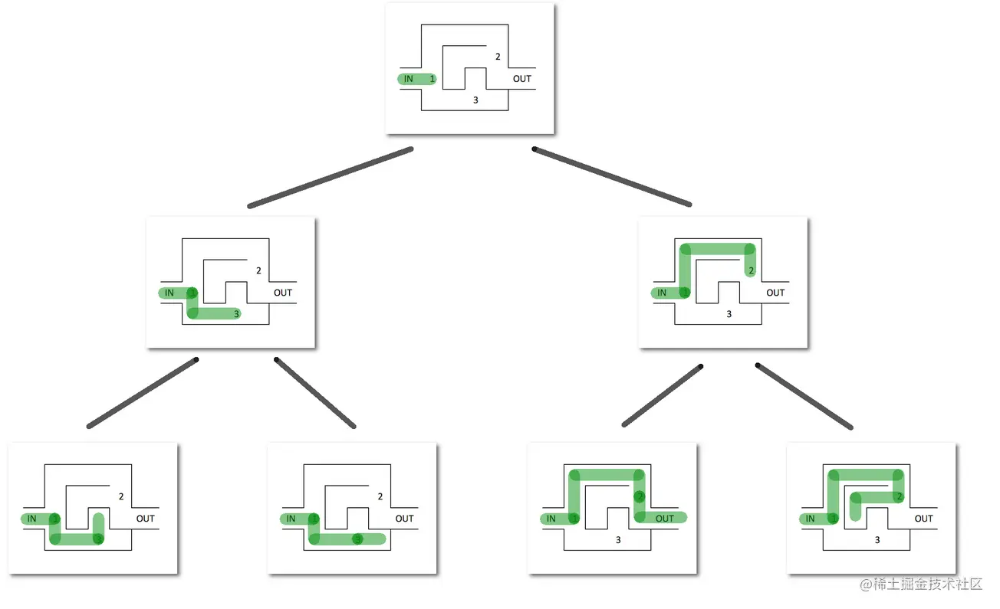

# 回溯算法

回溯是一种通用的算法思想，常用于解决一些搜索和优化问题。

基本思想是：在搜索的过程中，如果当前的状态不能导致问题的解决，就回溯到上一步的状态，并尝试其他的可能性，直到找到问题的解或者搜索完所有的可能性

回溯的处理思想，有点类似枚举搜索。我们枚举所有的解，找到满足期望的解。为了有规律的枚举所有可能的解，避免遗漏和重复，我们把问题求解的过程分为多个阶段，每个阶段，我们都会面对一个岔路口，我们先随意选一条路走，当发现这条路走不通的时候，就回退到上一个岔路口，另选一种走法继续走

通常使用递归来实现，每一次递归都代表了问题求解的一个阶段。在每个阶段，算法都会面临多个选择，他会尝试每一个选择，并在进入下一个阶段之前保存当前的状态。如果当前的选择不能导致问题的解决,算法就会回溯到上一个阶段,并尝试其他的选择

## 思想

回溯法解决的问题的所有选项可以用树状结构表示

- 在某一步有n个可能的选项，该步骤可看作树中一个节点
- 节点每个选项看成节点连线，到达它的n个子节点
- 叶节点对应终结状态
- 叶节点满足约束条件，则为一个可行的解决方案
- 叶节点不满足约束条件，回溯到上一个节点，并尝试其他叶子节点
- 节点所有子节点均不满足条件，再回溯到上一个节点
- 所有状态均不能满足条件，问题无解



## 复杂度

回溯算法的时间复杂度通常比较高，因为它需要尝试所有的可能性。在最坏的情况下，回溯算法的时间复杂度可以达到指数级别。因此：在使用回溯算法时，通常需要一些剪枝策略来减少搜索的范围。从而提高算法的效率

## 应用场景

- 深度优先搜索算法
- 正则表达式匹配
- 编译原理中的语法分析

举例
八皇后问题（每个棋子所在的行、列、对角线都不能有另一个棋子）

```javascript
const result = []; //全局或成员变量,下标表示行,值表示queen存储在哪一列
const cal8Queens = (row) => { // 调用方式：cal8queens(0);
  if (row == 8) { // 8个棋子都放置好了，打印结果
    printQueens(result);
    return; // 8行棋子都放好了，已经没法再往下递归了，所以就return
  }
  for (let column = 0; column < 8; ++column) { // 每一行都有8中放法
    if (isOk(row, column)) { // 有些放法不满足要求
      result[row] = column;  // 第row行的棋子放到了column列
      cal8Queens(row + 1); // 考察下一行
    }
  }
}
const isOk = (row, column) => {
  let leftup = column - 1, right = column + 1;
  for(let i = row - 1; i >= 0; --i) { // 逐行往上考察每一行
    if (result[i] == column) return false; // 第i行的column列有棋子吗？
    if (leftup >= 0) { // 考察左上对角线：第i行leftup列有棋子吗？
      if (result[i] == leftup) return false;
    }
    if (rightup < 8) { // 考察右上对角线：第i行rightup列有棋子吗？
      if (result[i] == rightup) return false;
    }
    --leftup; ++rightup
  }
  return true;
}
const printQueens = (result) => {
  for(let row = 0; row < 8; ++row) {
    for (let column = 0; column < 8; ++column) {
      if (result[row] == column) {
        console.log('Q');
      } else {
        console.log('*');
      }
    }
  }
}
```

0-1 背包

我们有一个背包，背包总的承载重量是 W kg。现在我们有 n 个物品，每个物品的重量不等，并且不可分割。我们现在期望选择几件物品，装载到背包中。在不超过背包所能装载重量的前提下，如何让背包中物品的总重量最大

```javascript
// cw表示当前已经装进去的物品的重量和；
// i表示考察到哪个物品了；
// w背包重量；
// items表示每个物品的重量；
// n表示物品个数
// 假设背包可承受重量100，物品个数10，物品重量存储在数组a中，那可以这样调用函数：
// f(0, 0, a, 10, 100)
function bag01(max, n, items) {
    const f = (i, cw, items, n, w) => {
        if (cw == w || i == n) { // cw==w表示装满了;i==n表示已经考察完所有的物品
            if (cw > maxW) {
                maxW = cw;
            }
            return;
        }
        f(i + 1, cw, items, n, w);
        if (cw + items[i] <= w) { // 已经超过可以背包承受的重量的时候，就不要再装了
            f(i + 1, cw + items[i], items, n, w);
        }
    }
    let maxW = 0;
    f(0, 0, items, n, max)
    return maxW;
}
```
