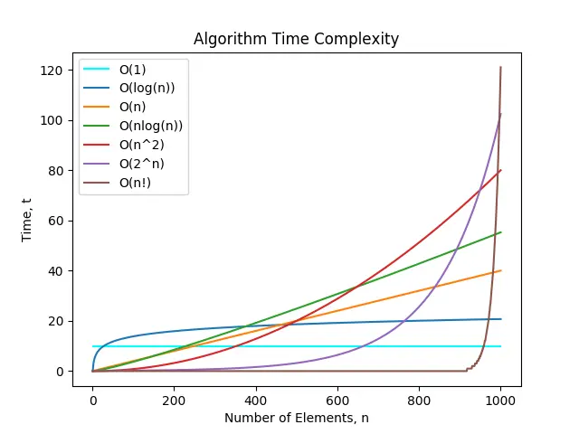

# 数据算法和结构

## 复杂度

### 时间复杂度

一个算法的时间复杂度反映了程序运行从开始到结束所需要的时间。把算法中基本操作重复执行的次数(频率)作为算法的时间复杂度

常见的时间复杂度

- O(1)：常数时间 (Constant) 表示算法执行时间与输入规模无关,不随输入规模的增大而增加
- O(log n)：对数时间 (Logarithmic) 表示算法执行时间随着输入规模的增大而缓慢增加,如二分查找
- O(n)：线性时间 (Linear) 表示算法执行时间与输入规模成正比,如简单的遍历操作
- O(n log n)：对数线性时间 (Logarithmic Linear) 算法执行时间介于线性和二次方之间,如快速排序和归并排序
- O(n^2)：平方时间 (Square) 表示算法执行时间与输入规模的平方成正比,如简单的嵌套循环
- O(n^3)：立方时间 (Cube)
- O(2^n)：指数时间 (Exponential) 表示算法执行时间随着输入规模的增大而急剧增加,如暴力解决旅行商问题
- O(n!)：阶乘时间 (Factorial)

### 空间复杂度

空间复杂度表示算法执行过程中所需的额外内存空间。描述了算法在最坏情况下的空间使用上界

常见的空间复杂度

- O(1)：常数空间 (Constant Space) 表示算法只需要固定大小的额外内存空间,不随输入规模的增大而增加
- O(n)：线性空间 (Linear Space) 表示算法所需的额外内存空间与输入规模成正比,如创建一个与输入规模相同的数组
- O(n^2)：平方空间 (Square Space) 表示算法所需的额外内存空间与输入规模的平方成正比,如创建一个二维数组来存储中间结果

## 数据结构

### 逻辑结构

逻辑结构就是指数据之间的关系，逻辑结构大概统一分成两种：线性结构和非线性结构

- 线性结构：数据之间存在一对一的关系，如数组、栈、队列、链表、线性表
- 非线性结构：数据之间存在一对多的关系，如二维数组、树、图、多叉树和环

### 存储结构

存储结构指的是数据在计算机内存中的实际存储方式

- 顺序存储：顺序存储是指将数据元素连续存储在内存中的一块区域内，如数组、链表； 顺序存储结构访问元素速度快,但插入和删除操作可能需要移动其他元素
- 链式存储：指将数据元素存储在内存中的不同位置,通过指针或引用将它们连接起来，链表是典型的链式存储结构,每个节点包含数据和指向下一个节点的指针。链式存储结构插入和删除元素方便,但访问元素需要遍历链表
- 索引存储：索引存储是在顺序存储或链式存储的基础上,添加一个索引表来加快数据的访问速度。索引表通常是一个数组,存储了数据元素的地址或指针。通过索引表可以快速定位到所需的数据元素
- 散列存储：散列存储(哈希存储)是通过哈希函数将关键字映射到存储位置的一种方式。它利用哈希表来存储数据,通过计算关键字的哈希值来确定数据的存储位置。散列存储提供了快速的插入、删除和查找操作

### 常见的逻辑结构和存储结构的组合示例

- 数组
  - 逻辑结构：线性结构
  - 存储结构：顺序存储
- 链表
  - 逻辑结构：线性结构
  - 存储结构：链式存储
- 栈
  - 逻辑结构：线性结构
  - 存储结构：顺序存储或链式存储
- 队列
  - 逻辑结构：线性结构
  - 存储结构：顺序存储或链式存储
- 二叉树
  - 逻辑结构：树形结构
  - 存储结构：顺序存储或链式存储
- 图
  - 逻辑结构：图形结构
  - 存储结构：邻接矩阵(顺序存储)或邻接表(链式存储)
- 哈希表
  - 逻辑结构：集合
  - 存储结构：散列存储
