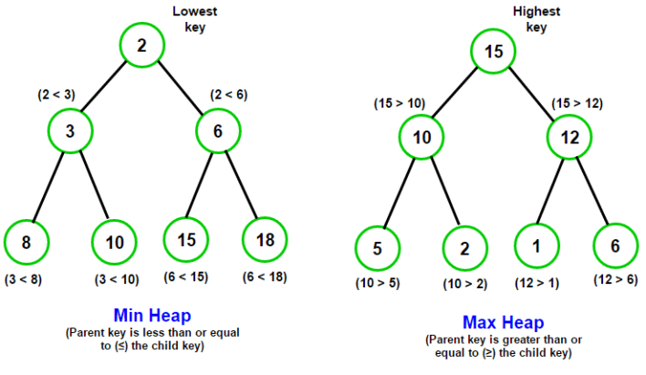

# 堆的基本操作

## 基本结构

- 堆的底层实际上是一颗完全二叉树
- 可以用数组数显
- 每个的节点元素值不小于其子节点 - 最大堆
- 每个的节点元素值不大于其子节点 - 最小堆



```js
// 大顶堆
// 和孩子节点的最大值max比较
// 大于max — 不需要在下沉
// 小于max — 和max交换位置 - 继续和下一层孩子节点比较，直到队列末尾
function ajustMaxHeap(array, index, length) {
  for (let i = 2 * index + 1; i < length; i = 2 * i + 1) {
    if (i + 1 < length && array[i + 1] > array[i]) {
      i++;
    }
    if (array[index] >= [array[i]]) {
      break;
    } else {
      [array[index], array[i]] = [array[i], array[index]];
      index = i;
    }
  }
}

function createMaxHeap(arr, length) {
  for (let i = Math.floor(length / 2) - 1; i >= 0; i--) {
    ajustMaxHeap(arr, i, length);
  }
  return arr;
}
```

```js
// 小顶堆
function ajustMinHeap(array, index, length) {}
function createMinHeap(arr, length) {
  for (let i = Math.floor(length / 2) - 1; i >= 0; i--) {
    ajustMinHeap(arr, i, length);
  }
  return arr;
}
```

## 堆的插入

- 由于堆属于优先队列，只能从末尾添加
- 添加后可能破坏堆的结构，需要从下到上进行调整
- 如果元素小于父元素：上浮

```js
// 以小顶堆为例
function minHeadAdd (array = [], element) {
  array.push(element);
  if (array.length > 1) {
    let index = array.length - 1;
    let target = Math.floor((index - 1) / 2);
    while (target >= 0) {
      if (array[index] < array[target]) {
        [array[index], array[target]] = [array[target], array[index]]
        index = target;
        target = Math.floor((index - 1) / 2);
      } else {
        break;
      }
    }
  }
}
```

## 堆的移除

- 由于堆属于优先队列，只能从头部移除
- 移除头部后，使用末尾元素填充头部，开始头部下沉操作

```js
function minHeadPop (array = []) {
  let result = null;
  if (array.length > 1) {
    result = array[0];
    array[0] = array.pop();
    ajustMinHeap(array, 0, array.length);
  } else if (array.length === 1) {
    return array.pop();
  }
  return result;
}
```

### 数据流中的中位数

如何得到一个数据流中的中位数？如果从数据流中读出奇数个数值，那么中位数就是所有数值排序之后位于中间的数值

如果从数据流中读出偶数个数值，那么中位数就是所有数值排序之后中间两个数的平均值。我们使用Insert()方法读取数据流，使用GetMedian()方法获取当前读取数据的中位数

思路：

- 维护一个大顶堆，一个小顶堆，数据总数：
  - 小顶堆里的值大于大顶堆里的
  - 两个堆的元素个数相差不能超过1
- 当插入数字后数据总数为奇数时：使小顶堆个数比大顶堆多1；当插入数据后数据总数为偶数时：使大顶堆和小顶堆个数一样
- 当总数字个数为奇数时，中位数就是小顶堆的堆顶元素；当总数个数为偶数时，中位数就是两个堆顶元素的平均值

```js
class Heap {
  constructor (type = 'min') {
    this.type = type;
    this.value = [];
    this.count = 0;
  }
  add (element) {
    const array = this.value;
    array.push(element);
    if (array.length > 1) {
      let index = array.length - 1;
      let target = Math.floor((index - 1) / 2);

      while (target >= 0) {
        if (this.type === 'min' && array[index] < array[target] || this.type === 'max' && array[index] > array[target]) {
          [array[index], array[target]] = [array[target], array[index]];
          index = target;
          target = Math.floor((index - 1) / 2);
        } else {
          break;
        }
      }
    }
  }
  adjust () {
    const array = this.value;
    
  }
  pop () {
    const array = this.value;
    let result = null;
    if (array.length > 1) {
      result = array[0];
      array[0] = array.pop();
      ajustMinHeap(array, 0, array.length);
    } else if (array.length === 1) {
      return array.pop();
    } else {
      return result;
    }
  }
}
const maxHeap = new Heap('max');
const minHeap = new Heap('min');
let count = 0;
function insert (num) {
  count++;
  if (count % 2 === 1) {
    maxHead.add(num);
  }
}
function getMedian (nums) {

}
```

### 最小的k个数
